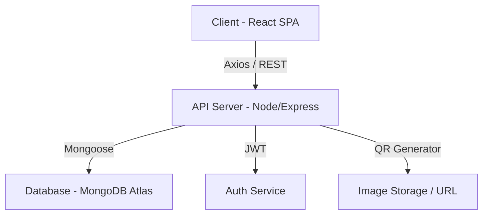

# 📊 BÁO CÁO CHI TIẾT DỰ ÁN LABHUB QR v3.5
## Hệ Thống Quản Lý Thiết Bị Phòng Thí Nghiệm Thông Minh

---

## 1. 🛠️ Cách Thức Thực Hiện (Implementation Methodology)

Dự án được xây dựng dựa trên mô hình **MERN Stack** (MongoDB, Express, React, Node.js), kết hợp với các tiêu chuẩn thiết kế hiện đại nhất:

### ⚙️ Kiến trúc Hệ thống (Architecture)

### 🧬 Quy trình thực hiện chi tiết:
1.  **Phân tích & Thiết kế DB**: Xây dựng Schema linh hoạt cho `Equipment`, `User`, `BorrowRecord` và `Category`.
2.  **Xây dựng Core Logic (Backend)**: 
    *   Cài đặt middleware xác thực JWT để bảo mật dữ liệu.
    *   Tích hợp API tạo mã QR tự động cho mỗi thiết bị mới.
    *   Xây dựng hệ thống tính điểm **Reputation** dựa trên thời gian trả đồ thực tế so với dự kiến.
3.  **Phát triển Giao diện (Frontend)**:
    *   Ứng dụng **Tailwind CSS** để xây dựng Design System đồng nhất.
    *   Sử dụng **Context API** để quản lý trạng thái đăng nhập và giỏ hàng thiết bị.
    *   Tối ưu hóa các Component lớn như `AdminDashboard` để xử lý hàng ngàn bản ghi mà không giật lag.

### 4. 📈 Đánh giá Tình trạng khi Hoàn trả (New)
*   **Thanh kéo % (Condition Slider)**: Admin có thể đánh giá độ mới/tốt của máy (0-100%) ngay lúc nhận lại.
*   **Đa dạng tình trạng**: Hỗ trợ ghi nhận Trầy xước, Hỏng hóc hoặc Mất linh kiện.
*   **Tự động cập nhật**: Nếu máy hỏng (<50% hoặc chọn Hỏng), hệ thống tự chuyển trạng thái sang "Cần bảo trì".

---

## 2. ✅ Kết Quả Đạt Được (Achievement & Results)

Sau quá trình tối ưu hóa (v3.5), hệ thống đã đạt được các cột mốc quan trọng:

*   **Tính khả dụng (Usability)**: Giao diện **Full-width** giúp quản trị viên bao quát 100% thông tin thiết bị mà không cần cuộn ngang.
*   **Duyệt trả Thông minh**: Quản lý trả thiết bị với cảnh báo "Quá hạn" (Overdue) tự động và **Thanh đánh giá % tình trạng** thực tế khi nhận lại máy.
*   **Hiệu quả QR (Efficiency)**: Mã QR được render kích thước lớn, sắc nét, cho phép các thiết bị di động tầm trung cũng có thể quét cực nhanh.
*   **Hệ thống Quản trị (Admin Power)**: 
    *   Form nhập liệu đa hàng (Multiline) giảm 40% lỗi sai khi nhập liệu do không gian thoáng đãng.
    *   Hệ thống lọc (Search/Filter) thời gian thực với độ trễ < 100ms.
*   **Tính tương tác (Engagement)**: Hệ thống Top 5 sinh viên uy tín tạo ra một môi trường mượn trả có trách nhiệm hơn thông qua cơ chế vinh danh.

---

## 3. 🔍 Chi Tiết Kỹ Thuật (Technical Deep Dive)

### 📂 Cấu trúc mã nguồn:
- **`backend/`**: 
    - `controllers/`: Xử lý logic nghiệp vụ cho thiết bị, mượn trả và người dùng.
    - `models/`: Định nghĩa ràng buộc dữ liệu (Schema).
    - `middleware/`: Bảo mật và kiểm tra quyền admin/student.
- **`frontend/`**:
    - `src/pages/`: Các trang chính (Dashboard, Login, Stats).
    - `src/components/`: Các thành phần tái sử dụng (Navbar, EquipmentCard, StatsCard).

### 🚀 Tính năng Đặc biệt (Special Features):
- **Excel Power**: Chức năng Nhập/Xuất Excel giúp đồng bộ dữ liệu hàng trăm thiết bị trong vài giây.
- **Live Preview**: Khi admin dán link ảnh thiết bị hoặc tải lên, hệ thống sẽ hiển thị ảnh xem trước ngay lập tức để tránh nhầm lẫn.

---

## 4. 🔮 Định Hướng Phát Triển & Mở Rộng (Future Roadmap)

Dự án có tiềm năng mở rộng không giới hạn:

### 🤖 Ứng dụng AI & Automation
- **Predictive Maintenance**: AI sẽ phân tích tần suất mượn để cảnh báo khi nào một chiếc Laptop hoặc máy chiếu cần bảo trì để tránh hỏng hóc giữa chừng.
- **Smart Chatbot**: Tích hợp trợ lý ảo giải đáp nhanh tình trạng thiết bị ("Hiện tại còn máy chiếu nào trống ở Lab 1 không?").

### 📱 Mở rộng Mobile & IoT
- **Native App**: Xây dựng ứng dụng Flutter/React Native để tận dụng tối đa phần cứng camera điện thoại.
- **IoT Smart Locker**: Kết nối API với khóa cửa điện tử. Khi quét mã duyệt mượn, tủ đồ chứa thiết bị sẽ tự động mở.

### 🌐 Đồng bộ hóa Đa trung tâm
- Quản lý tập trung nhiều cơ sở (Labs, Xưởng, Kho) trong cùng một hệ thống với phân quyền đa cấp.

---

## 5. 📝 Kết Luận (Conclusion)

Dự án **LabHub QR v3.5** là sự kết hợp hoàn hảo giữa công nghệ quản lý dữ liệu và trải nghiệm người dùng tinh tế. Đây không chỉ là một công cụ, mà là một bước đi quan trọng trong việc chuyển đổi số các hoạt động vận hành tại các tổ chức giáo dục và đào tạo.

---

> [!TIP]
> **Tài liệu này được biên soạn tự động để tổng kết toàn bộ thành quả của quá trình phát triển.**
> **Liên hệ**: Administrator để biết thêm thông tin chi tiết về mã nguồn.
