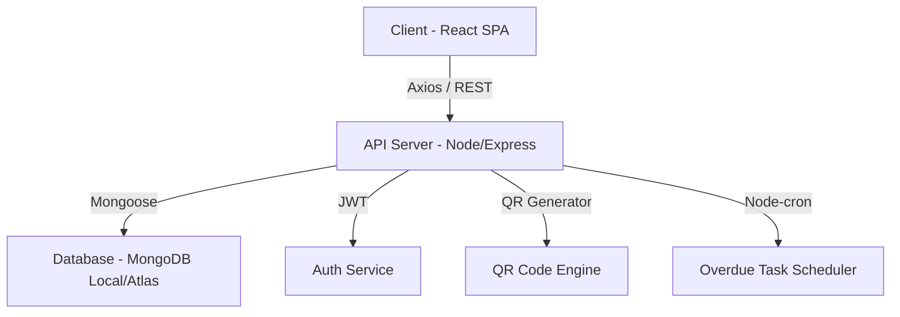

# 🛡️ LabHub QR v3.5 - Hệ Thống Quản Lý Thiết Bị Phòng Lab Thông Minh

[](https://reactjs.org/)
[](https://nodejs.org/)
[](https://www.mongodb.com/)
[](https://tailwindcss.com/)

**LabHub QR** là giải pháp quản lý thiết bị phòng thí nghiệm toàn diện dựa trên mã QR, giúp tối ưu hóa quy trình mượn trả, theo dõi tình trạng thiết bị và quản lý người dùng một cách chuyên nghiệp và hiệu quả.

---

## 🌟 Tính năng Nổi bật

### 🛠️ Dành cho Quản trị viên (Admin)
- **Bảng điều khiển Tổng lực (Admin Power):** Theo dõi thời gian thực tình trạng thiết bị, mượn trả và các báo cáo vi phạm.
- **Quản lý QR Code Tập trung:** Tự động tạo mã QR chất lượng cao cho hàng nghìn thiết bị, hỗ trợ in ấn hàng loạt.
- **Kiểm soát Tình trạng Thiết bị:** Hệ thống đánh giá % tình trạng (Condition evaluation) khi trả máy, tự động chuyển sang chế độ bảo trì nếu chất lượng thấp.
- **Quản lý Danh mục & Kho:** Phân quyền quản lý theo nhiều phòng Lab, Xưởng hoặc Kho lưu trữ.
- **Excel Power:** Nhập/Xuất dữ liệu hàng loạt từ file Excel chỉ trong vài giây.
- **Hệ thống Phạt (Fine System):** Tự động tính toán lỗi vi phạm và quản lý các khoản phạt nếu trả chậm hoặc làm hỏng thiết bị.

### 🎓 Dành cho Người dùng (Sinh viên/Giảng viên)
- **Danh mục Thiết bị Trực quan:** Tìm kiếm, lọc theo danh mục dạng Dropdown hiện đại, xem thông tin chi tiết với ảnh Live Preview.
- **Quy trình Mượn/Đặt chỗ:** Đặt chỗ trước (Reservation) cho các thiết bị đang bận hoặc mượn ngay các thiết bị sẵn có.
- **Giỏ mượn Thông minh:** Cho phép chọn nhiều thiết bị và mượn cùng lúc (Bulk Borrow) cực nhanh.
- **Quét mã QR:** Sử dụng camera di động để xem thông tin thiết bị hoặc thực hiện mượn/trả nhanh tại chỗ.
- **Hệ thống Uy tín (Reputation):** Càng trả đồ đúng hạn, điểm uy tín càng cao, giúp tăng cơ hội mượn các thiết bị cao cấp.

---

## ⚙️ Kiến trúc Hệ thống



---

## 🛠️ Công nghệ Sử dụng

- **Frontend:** React Context API, Vite, Tailwind CSS, Lucide React (Icons), Recharts (Biểu đồ).
- **Backend:** Node.js, Express.js, Mongoose, JWT (Xác thực), Nodemon.
- **Database:** MongoDB (Local Community Server / Shared In-Memory DB).
- **Automation:** Node-cron (Kiểm tra trả chậm mỗi 15 phút).

---

## 🚀 Hướng dẫn Cài đặt & Khởi chạy

### 1. Yêu cầu Hệ thống
- **Node.js**: Phiên bản 16.x trở lên.
- **MongoDB**: Phiên bản 4.x trở lên (Đã bật dịch vụ mongod).

### 2. Cài đặt các thư viện
Mở Terminal và chạy các lệnh sau:

```bash
# Cài đặt cho Backend
cd backend
npm install

# Cài đặt cho Frontend
cd ../frontend
npm install
```

### 3. Cấu hình Môi trường
Tạo file `.env` trong thư mục `backend` với nội dung sau:
```env
PORT=5000
MONGO_URI=mongodb://localhost:27017/lab-equipment-db
JWT_SECRET=supersecret123
FRONTEND_URL=http://localhost:5173
```

### 4. Chạy Ứng dụng
Chạy đồng thời 2 Terminal:

**Terminal 1 (Backend):**
```bash
cd backend
npm run dev
```

**Terminal 2 (Frontend):**
```bash
cd frontend
npm run dev
```

---

## 📁 Cấu trúc Thư mục
```text
HeThongQuanLyThietBiLab/
├── backend/            # API Server (Controllers, Models, Middleware, Cron)
├── frontend/           # UI Application (React, Tailwind, Assets)
├── database_backup/    # Script nạp dữ liệu và bản lưu trữ JSON
├── README.md           # Tài liệu dự án
└── .gitignore          # Cấu hình bỏ qua tệp tin
```

---

## 👥 Đội ngũ Phát triển - Nhóm 4

Dự án được thực hiện và duy trì bởi các thành viên:

1.  **Trịnh Tiến Trung** - [Github Profile](https://github.com/TTTrung1007)
2.  **Tằng Mằn Pố** - [Github Profile](https://github.com/tangpo1273)
3.  **Vũ Phương Thảo** - [Github Profile](https://github.com/suznvu010803-code)

---
**© 2026 LabHub Team. Phát triển cho mục đích giáo dục và quản lý nội bộ.**
